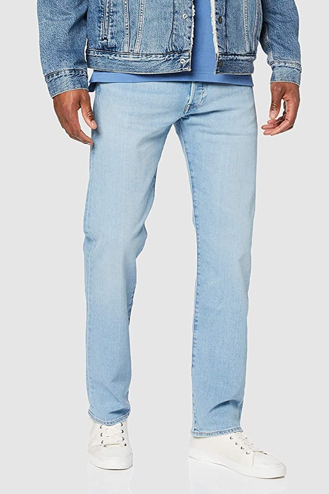
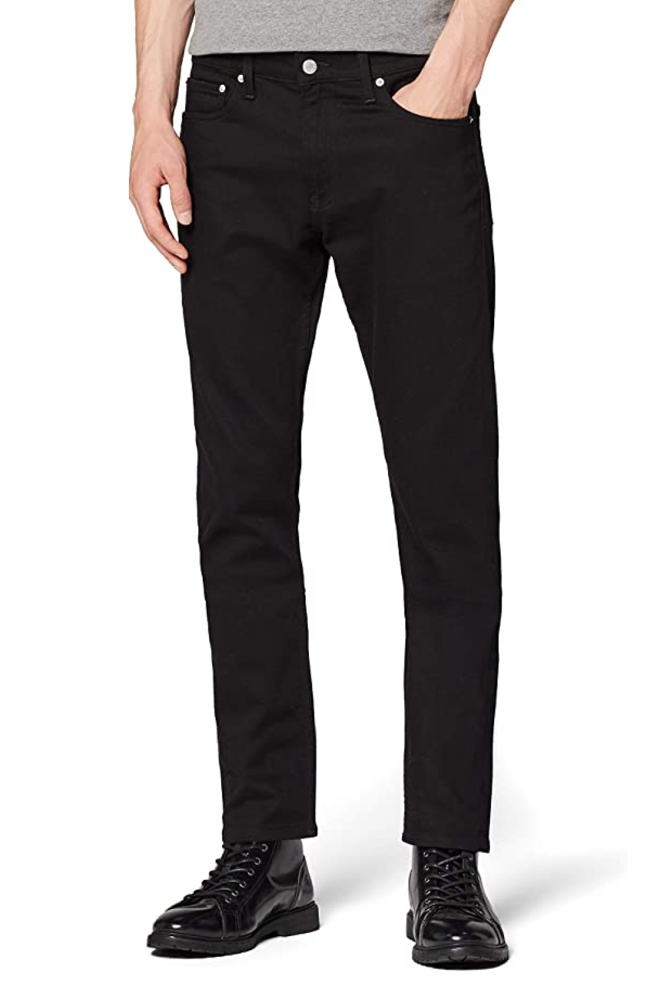
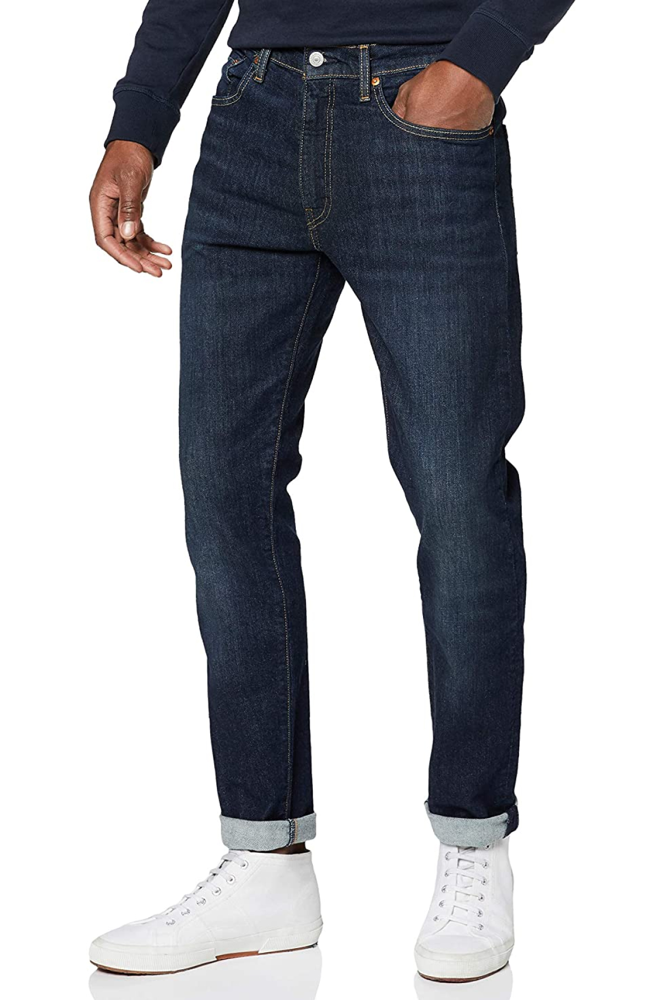

import ShopBtn from '../../../src/components/post/shopBtnMdx.js'

What can i say - I love denim! They provide a solid start to any outfit.
weather you subscribe to a simple t-shirt and sneakers combo or prefer to dress your jeans up with shoes and a shirt;
denim is undoubtably the most versatile items of clothing that forms the backbone of any wardrobe. 
Truely the most democratic piece of clothing anyone can have in their wardrobe.

***You only need three types of denim - Summer, Everyday & Evening***

The number one most important thing to consider when buying jeans is the FIT. You dont want to be wearing a pair
that looks like a hand me down.. unless thats the look you're going for.
you almost always want stay to the left of the spectrum when it comes to fits - skinny, slim or tapered - at a
maximum i would say straight also has a place anything greater than that and you risk looking like an extra in a
90s gangster rap music video.

The second consideration should be the wash. With washes there is a time and a place - for example if you're wearing
them out in the evenings you'll want them to be darker(black/dark grey etc) to almost mimic trousers. If you're 
wearing them during the day they should be stone wash(if its sunny and you're near the coast), 
dark indigo or genrally some shade of blue.

The weight and elasticity is also important. If you're a denim purist then the heavier the better however most
people (including myself) value a certain level of comfort so be sure to keep a look out for those that have 
2/3% elastane. Below is an edit of some of my favourite and most versatile pieces to fit any occasion.

------------

## Levi's 501 Original Fit - Stone Wash

<ShopBtn text={`Shop`} url={`https://amzn.to/3ezG5Tb`} />

## Calvin Klein Slim Jeans

<ShopBtn text={`Shop`} url={`https://amzn.to/2Bk8Uov`} />

## Levi's 512 Slim Taper

<ShopBtn text={`Shop`} url={`https://amzn.to/3gCOPdd`} />