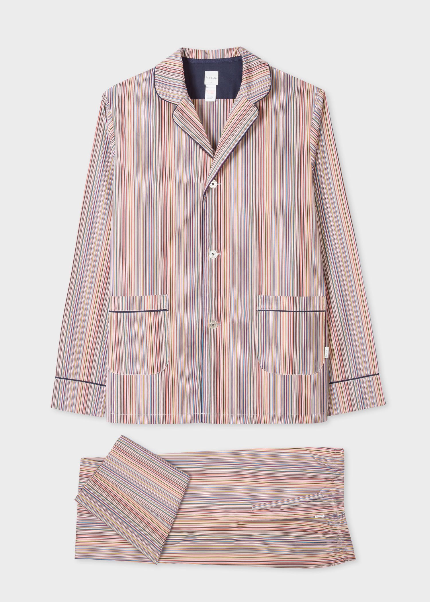
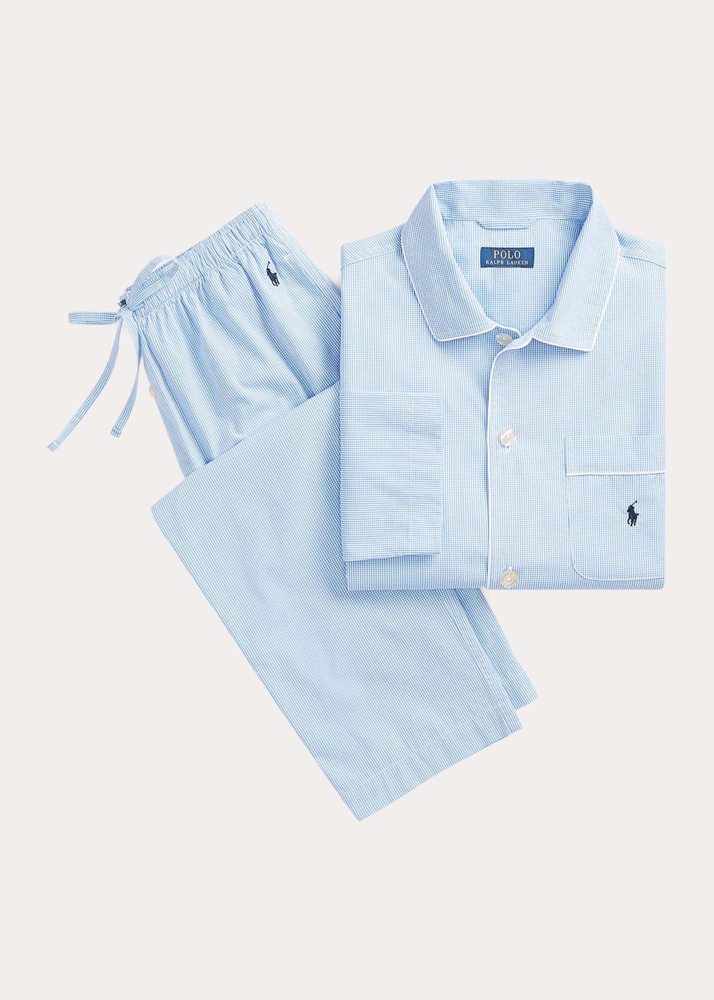
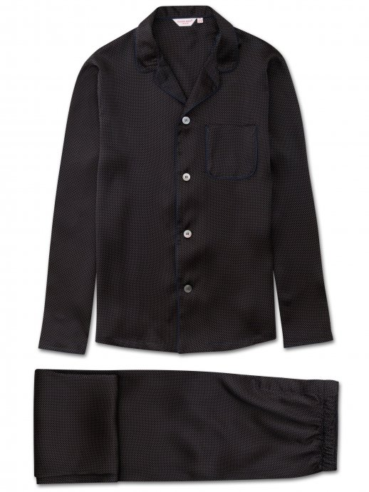
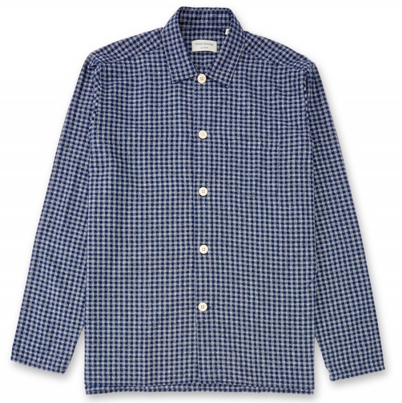

<!-- <a href="https://twitter.com/share?ref_src=twsrc%5Etfw" class="twitter-share-button" data-show-count="false" 
onclick="window.open(this.href, 'mywin','left=0,top=0,width=500,height=250,toolbar=1,resizable=0'); return false;">
Tweet
</a>
 -->

<!-- <iframe src="https://www.facebook.com/plugins/share_button.php?href=https%3A%2F%2Fwww.themavenist.com%2Ffashion%2Fdenim-guide&layout=button_count&size=large&width=88&height=28&appId" width="88" height="3" style="border:none;overflow:hidden" scrolling="no" frameborder="0" allowTransparency="true" allow="encrypted-media"></iframe> -->

<!-- <iframe src="https://www.facebook.com/plugins/share_button.php?href=https%3A%2F%2Fwww.themavenist.com%2Ffashion%2Fhow-to-lounge-in-a-lockdown&layout=button_count&size=large&width=88&height=28&appId" width="88" height="28" style="border:none;overflow:hidden" scrolling="no" frameborder="0" allowTransparency="true" allow="encrypted-media"></iframe> -->

If there's one thing that we're all guilty of lately, it's lounging.
I for one have felt like i've been in a state sanctioned blackhole ever since we were advised not to leave our homes.

I dont even know what day it is - monday? wednesday? Does time even exist in the fourth dimesion?

This morning, like most mornings this month i started my day by prepping my filter.
Brew in hand i begin my migration - a lone wildebeast navigating through the masai mara in search of the preverbial green pasture of my sofa.

------------

<iframe style="width:120px;height:240px;" marginwidth="0" marginheight="0" scrolling="no" frameborder="0" src="//ws-eu.amazon-adsystem.com/widgets/q?ServiceVersion=20070822&OneJS=1&Operation=GetAdHtml&MarketPlace=GB&source=ac&ref=tf_til&ad_type=product_link&tracking_id=themavenist-21&marketplace=amazon&region=GB&placement=B07YBNB2PS&asins=B07YBNB2PS&linkId=a507c9d7e781234545bb981b946a3d02&show_border=true&link_opens_in_new_window=true&price_color=333333&title_color=0066c0&bg_color=ffffff">
</iframe>

This mornings entertainment - the Leslie Neilsen classic, Naked Gun.
Half way through i get to the scene where Frank the inept 
police detective says - "Do you mind if i slip into something a little more comfortable" 
Queue the comical misdirection - Frank goes off and comes back with a dapper sartorial ensemble that 
would give Don Draper a run for his money. 

This inevitably leads me to think about the state of my own comfort. looking down at todays mismatch - 
A Charlie Brown t-shirt that reads "Charlie don't surf" (in ref to Coppola's brilliant - Apocolypse Now) 
paired with a light grey sweatpant.

I can't help but think it's about time i upped my loungwear game & got myself a "grown up" pair of PJs.

I havent owned a pair in a while. Come to think the last time i owned a set was when i was 11. A Lion King set with a prominent Simba print on the front.

Fast forward 20 years and here i am full circle, back on the hunt for PJs. Here's a shortlist of PJ's on the market that caught my attention.

## Paul Smith

<a  class="button" href="https://www.paulsmith.com/uk/men-s-signature-stripe-cotton-pyjama-set" target="_blank">
Shop
</a>

## Ralph Lauren

<a class="button" href="https://www.ralphlauren.co.uk/en/gingham-poplin-long-sleep-set-486046.html?dwvar486046_colorname=Light%20Blue%20Mini%20Gingham&cgid=men-accessories-loungewear-sleepwear&webcat=men%2Ffeatures%2FLoungewear#webcat=men%7Cfeatures%7CLoungewear&start=1&cgid=men-accessories-loungewear-sleepwear" target="_blank">
Shop
</a>

## Derek Rose

<a class="button" href="https://www.derek-rose.com/men/clothing/mens-nightwear/mens-modern-fit-piped-pyjamas-brindisi-45-pure-silk-satin-navy.html" target="_blank">
Shop
</a>

## Oliver Spencer

<a class="button" href="https://oliverspencer.co.uk/pyjama-shirt-cannington-blue" target="_blank">
Shop
</a>

