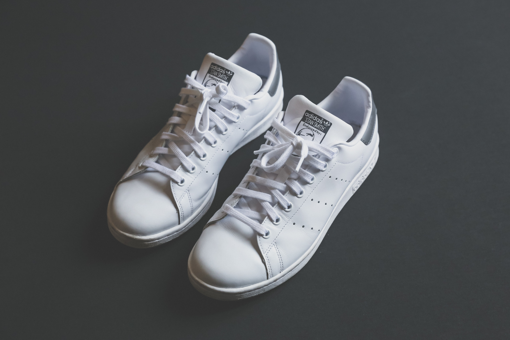
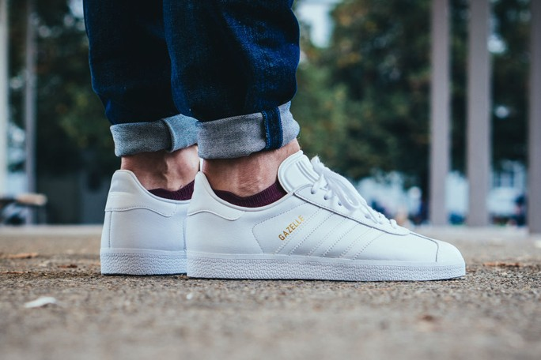
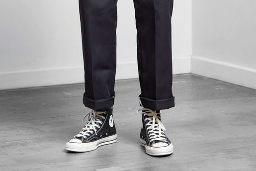
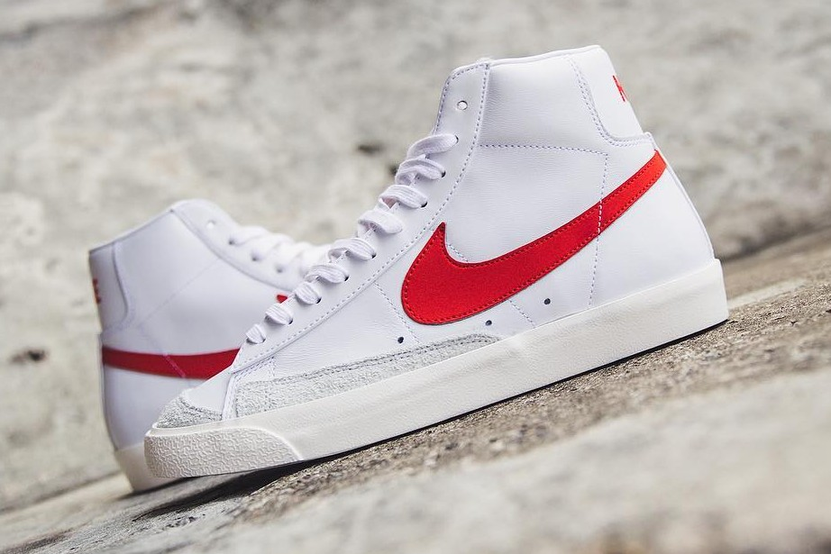
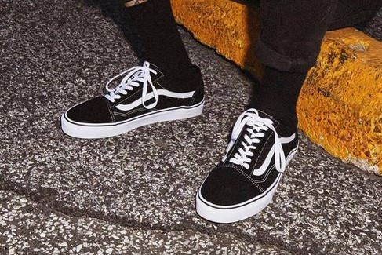

<!--  -->

When it comes to my sneaker philosophy it’s that every guy should have a core selection of go to kicks. No ifs, no buts – If you don’t and are buying them on the fly then you’re doing it all wrong. There's a few considerations that should be taken when it comes to selecting our "continuity" kicks:

1. Relatively easy to acquire year round – i.e Non-seasonal (We'll get to these in another post). 
2. Versatility is key - They'll need to be dressed up or pared down seamlessly. For this to work the colour palette has to be muted. Sticking to White/Black/Navy is key.
3. Form - The construction and overall shape is the difference between timeless classic and the liteny of "filler" designs by sneaker brands.   
4. Low cost (Primarily) - They will be worn anywhere and everywhere so will periodically need to be refreshed without breaking the bank each time we do.
5. Function - As mentioned they'll be worn anywhere & everywhere so should be comfortable at the very least.

### STAN SMITH

Coming in at 5th of the list
The most popular Adidas trainer of all time
Raf Simons has a premium versions of the shoe
Jay-Z name dropped him on his classic album, The Blueprint
low profile
multitude of coloured tabs
enduring appeal
genrational transcendence
KISS

### GAZELLE

The Gallagher brothers would constantly be seen wearing the classic 3 stripes trainer with the Gazelle featuring in a variety of Britpop music videos from the era.
white rubber midsole
has a long history dating back to the middle 60s
pretty much continuous production for 50 years
Although the Gazelle was built on a track shoe last, adidas went on to test the shoe with the West German national football team and top international handball players which would suggest a more general purpose athletic model.

But for me one word to describe 90s Gazelle would be ‘memories’. They conjure up images of acid jazz clubs, hip-hop, Cool Britannia, Madonna in head to toe adidas, New Labour, Loaded magazine, Martin Clunes in Men Behaving Badly, Lad Culture, Ministry of Sound, Oasis and the Britpop bands, Bleached blond Robbie Williams in adidas tracksuits, the Spice Girls and lest we not forget David Baddiel wearing Gazelle in the Three Lions video for Euro ‘96 – and with it being it being twenty years on from then, what better way to celebrate the Euros in Paris than with a piece of iconic 90s culture.

### CONVERSE ALL STAR 70s

heavy grade canvas
CDG Play Chucks
enduring appeal
Converse shoes are distinguished by a number of features, including the company's star insignia, the All Star's rubber sole, smooth rounded toe, and wrap-around strip
basketball & skating culture
was initially developed as a basketball shoe in the early 20th century. The design of the Chuck Taylor All Star has remained largely unchanged since its introduction in the 1920s. The shoe consists of a stitched upper portion, a toe cap that is usually made of white rubber, and a sole that is usually made of brown rubber. Although Chuck Taylors are made of various materials such as leather, the original and most widely known version of the shoe is made from cotton canvas

### NIKE BLAZER MID '77 VINTAGE

Recalling the slimline design cues of the 1977 Blazer, Nike call upon the seasoned hardwood legend for a '77 rewrite in ‘Habenero Red’. One of the hi-top’s first ever colourways, bold red covers the Swoosh in block colour; wrapping over its smooth leather uppers, while textured suedes guard the forefoot. An icon on and off the court, the Blazer is back; retro to the core with OG accents fully intact.
The Nike Blazer was first released in 1973 as Nike’s best basketball sneaker
The first Nike basketball shoe to carry the Swoosh,
sneaker would be named after the local basketball team, the Portland Trail Blazers.
It’s a simple shoe to this day, beloved for its simplicity
As basketball players left the Blazer behind, skaters took ownership of the sneaker and it found a second life that would ultimately save the silhouette from ever going out of style.
collabs CDG/ Supreme/ Off White Ten collection

### VANS OLD SKOOL

The classic style is summer’s most democratic shoe
The trick, it would seem, is in the sneaker’s simple yet instantly recognizable design: a low-top shoe with traditional laces, done in suede and canvas with clean white outsoles.
The Old Skool was first introduced by Vans in 1977, and was the first design to feature the brand’s iconic side stripe, which has become a hallmark design characteristic for the brand.
black-and-white style prevails as the most popular design, some 40 years later.
first released back in 1977, that swoop of leather was dubbed the 'jazz stripe', before becoming the 'sidestripe' that die-hard Vans fans now know it as.
Paired with its low cut, leather padded heels and slick suede panelling, the style has barely changed in its 40-year history
But its original purpose as a skating shoe
Unlike the classic Authentic style, which still manages to look a little like a primary school gym shoe on some of us, the Old Skool has a distinctly cooler aura
